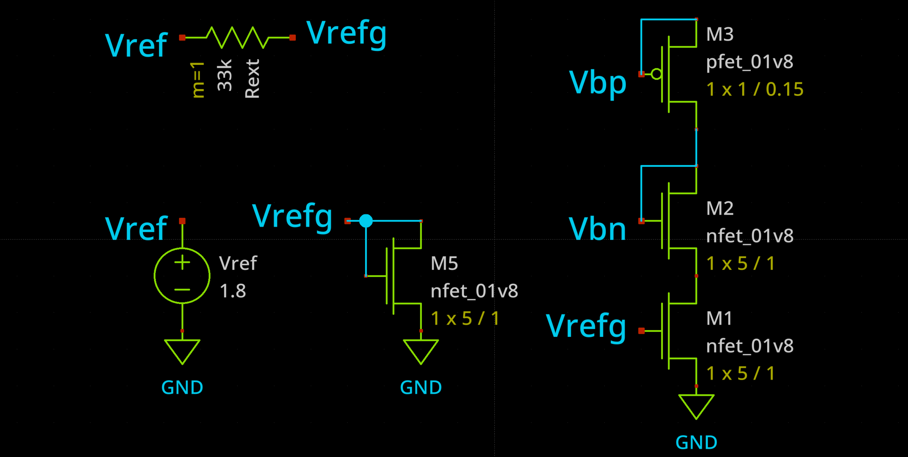
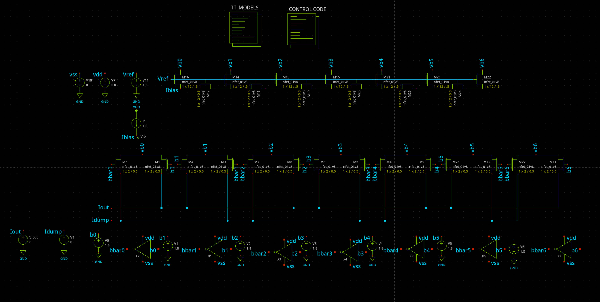
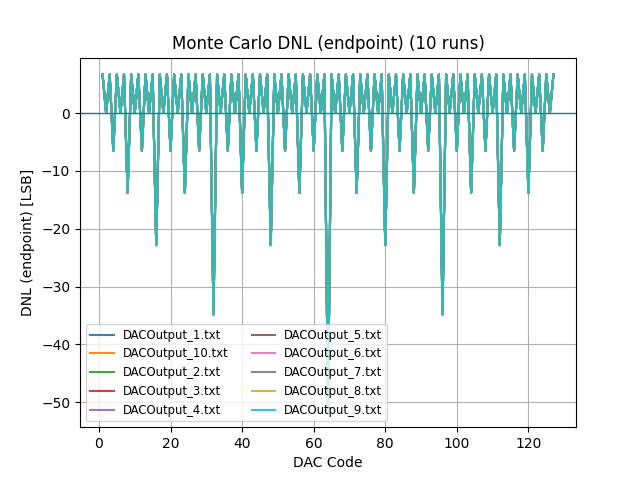
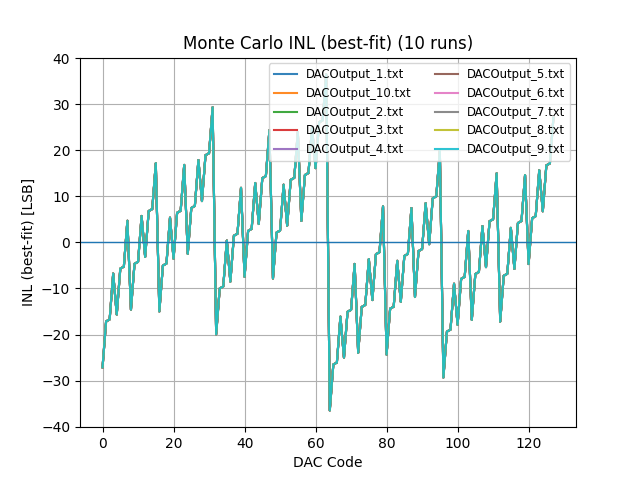
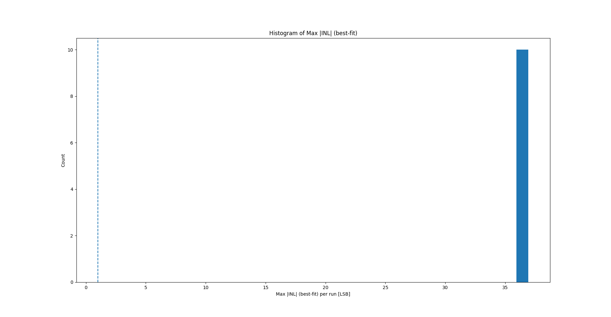
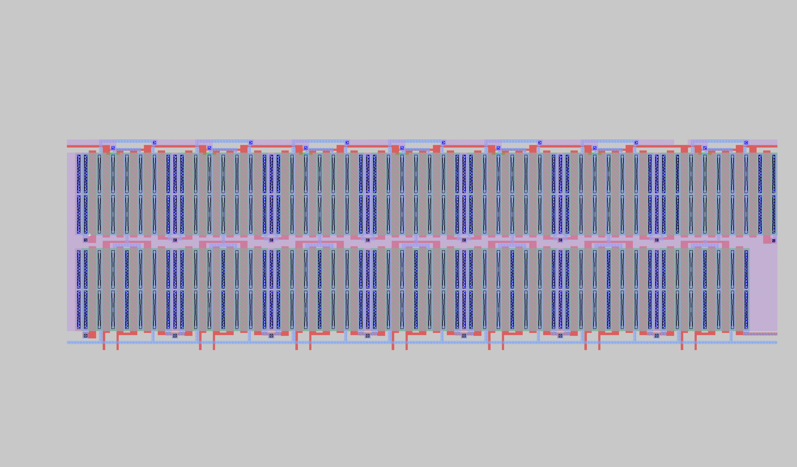

# MP3: Ladder DAC Design, Simulation, and Layout (SKY130)

**Author:** Owen Himsworth  
**Course:** MADVLSI – Miniproject 3  
**Date:** Oct 31, 2025

## 1. Abstract
This report documents the design, simulation, and first-pass layout of a **7-bit R–2R ladder DAC** in the **SKY130A** PDK. The schematic is complete (untuned; no bias network integrated), layout is placed/routed at a coarse level, and **LVS is currently failing**. Using **xschem, ngspice, Magic, and Netgen**, I generated transfer and linearity results. Measured linearity at nominal shows large code-dependent errors (**Max |DNL| ≈ 52 LSB**, **Max |INL| ≈ 36 LSB**), indicating design-level issues (pass-device R_on vs. ladder R, and/or LSB/FS definition) rather than random mismatch.

---

## 2. Introduction & Objectives
**Background.** An R–2R DAC uses a binary-weighted resistor network and code-controlled switches to generate an analog output.  
**Objective.** Implement a 7-bit DAC targeting monotonic behavior and acceptable linearity at **VDD = 1.8 V**, suitable as a building block for later integration.  
**Scope.** Schematic-level simulations (transfer, DNL/INL), an exploratory self-bias concept (not integrated), a first-pass layout, and preliminary verification (DRC/LVS WIP).

---

## 3. Tools & Methodology

### 3.1 EDA & PDK
- **PDK:** SKY130A  
- **Tools:** xschem, ngspice, Magic, Netgen (versions per local install)  
- **Environment:** `PDK_ROOT` and `SKY130_MODELS` set

### 3.2 Circuit Architecture
- **Topology:** R–2R ladder with **NMOS transmission switches**  
- **Resolution:** **7-bit** (b0…b6) with local inverters to generate **b̄0…b̄6**  
- **Reference:** **Vref = 1.8 V (external)**  
- **Switching:** per-bit inverters (X1…X7) drive NMOS pass devices  
- **Output load:** **TBD** (sims observe a high-Z probe at `Iout`; specify intended C/R if known)

### 3.3 Key Parameters
- **Supply rails:** VDD = **1.8 V**, VSS = 0 V  
- **Switch sizing:** pass NMOS around **W/L ≈ 2/0.5**  
- **Biasing:** not integrated; a **self-bias concept** was explored (Fig. 0)  
- **Buffering:** none; `Iout` observed directly

### 3.4 Simulation Setup
- **Analyses:** DC code sweep **0 → 127**; Monte Carlo attempted (10 runs)  
- **Linearity definitions:** **DNL (end-point LSB)** and **INL (best-fit line)**  
---

## 4. Results

**Figure 0 — Bias concept (exploratory; not used in sims).**  

**Figure 1 — DAC (schematic-level).**  

### 4.1 Linearity
**Method.** DNL computed with **end-point** LSB; INL computed with a **best-fit** line.

**Headline numbers (10 runs).**  
- **Max |DNL| ≈ 52 LSB**  
- **Max |INL| (best-fit) ≈ 36 LSB**

**Figures.**  
- **DNL overlay (10 runs):**  
    
- **INL overlay (10 runs):**  
    
- **Histogram of Max |DNL|:**  
    
- **Histogram of Max |INL|:**  
    

**Interpretation.** The large, periodic negative DNL dips and large best-fit INL indicate **binary-weighting / code-dependent gain** issues, dominated by **pass-device R_on vs. ladder R** and/or **incorrect full-scale/LSB definition**. Histograms are single-bin spikes, showing the Monte Carlo did **not** apply meaningful mismatch; these errors are **deterministic**, not random.

---

## 5. Layout & Verification

### 5.1 Layout Overview
**Figure 6 — Ladder layout (unit-cell tiling).**  

### 5.2 LVS
- **Status:** **Failing**  
- **Likely causes:** (1) missing **sky130A_setup.tcl** in Netgen; (2) commented/incorrect top `.subckt` header; (3) **pin order/name mismatch**; (4) `inv` pin mapping  
- **Fix plan:**  
  1. Ensure **matching top cells** in both netlists:  
     
  2. Run Netgen **with** the SKY130 setup file:  
     
  3. Re-export schematic from xschem with **LVS netlist** and **correct sym_pin order**  
  4. Verify `inv` subckt pin order matches its symbol usage

---

## 6. Discussion
- **Why errors are large:** With NMOS-only transmission switches, **R_on** adds series resistance to each branch; if **R_on** is not ≪ **R**, weights distort → large DNL/INL. Incorrect **LSB/FS** definitions can amplify reported errors.  
- **Immediate improvements:**  
  1) Recompute metrics with correct **LSB** and best-fit INL.  
  2) Increase ladder **R** or **widen pass devices**.  
  3) Re-check exact **R/2R** topology for each bit.  
  4) Enable **mismatch** in Monte Carlo (resistors/transistors) with unique seeds and per-run outputs.

---

## 7. Conclusion
- **Working:** Schematic simulations (transfer + linearity); first-pass layout placed.  
- **Not yet:** LVS clean; bias network integration; ladder/switch tuning and load specification.  
- **Next steps:** (1) Fix top-cell headers/pins and run Netgen with the SKY130 setup to reach **LVS clean**; (2) retune **R vs R_on** and re-measure INL/DNL with correct LSB; (3) enable true Monte Carlo variation.

---

